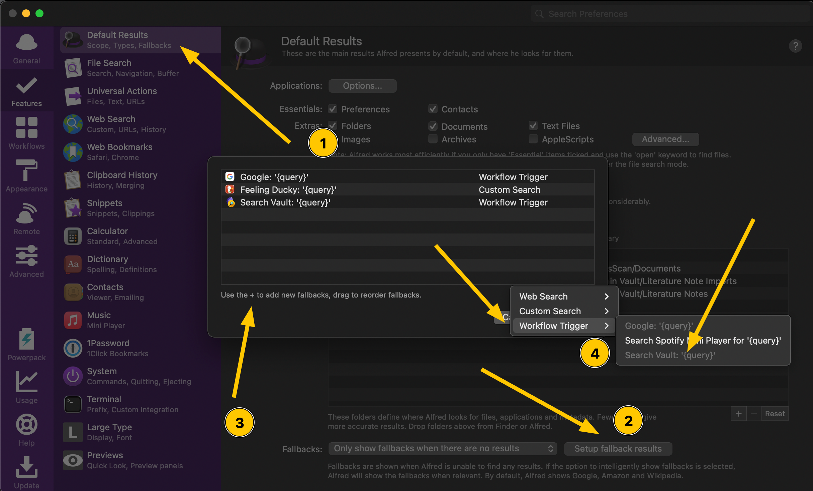

# Alfred-based Quick Switcher
The Alfred-based Quick Switcher is basically an enhanced version of [Obsidian's Quick Switcher Core Plugin](https://help.obsidian.md/Plugins/Quick+switcher).

## Table of Contents
<!-- MarkdownTOC -->

- [How the Search works](#how-the-search-works)
- [Main Search](#main-search)
	- [Search for Notes](#search-for-notes)
	- [Smart Queries](#smart-queries)
	- [Search for Aliases](#search-for-aliases)
	- [Search for Folders](#search-for-folders)
	- [Search for Headings](#search-for-headings)
- [Browse Links of a Note](#browse-links-of-a-note)
- [Search Notes via their Tags](#search-notes-via-their-tags)
- [Search Starred Files](#search-starred-files)
- [Search Recent Files](#search-recent-files)
- [Vault Search as Alfred Fallback](#vault-search-as-alfred-fallback)
- [Previewing Notes via Quicklook](#previewing-notes-via-quicklook)
	- [Hotkey Setting](#hotkey-setting)
	- [QLMarkdown or Peek](#qlmarkdown-or-peek)

<!-- /MarkdownTOC -->

## How the Search works
All the search features listed here do not *directly* search your vault, but rather use the metadata created by the [Metadata Extractor Plugin](https://obsidian.md/plugins?id=metadata-extractor) on a regular bases. By default, this happens every 30 minutes, meaning recently created notes, recently renamed notes, or recent tag changes are not picked up at once. You can change the meta data refresh rate via the Metadata Extractor Plugin's settings or refresh them manually via `oupdate → Manually Refresh Metadata`.

## Main Search
**`o`: Open files in your vault.**
This keyword searches all your notes, aliases, folders, and headings combined.

### Search for Notes
This works similar to Obsidian's built-in “QuickSwitch” feature, but can be triggered without Obsidian running (in which case it will open Obsidian with the selected note). Press `↵` to open the selected file in Obsidian.
- `⌘ + ↵`: Open the file in a new pane.
- `⌥ + ↵`: Reveal the file in Finder.
- `fn + ↵`: Append the content to the selected note.
	- Appended content depends on the [workflow configuration](Workflow%20Configuration.md#Alfred-based-Quick-Switcher) `input_append`. Set to `clipboard` will add the clipboard content, while setting it ti `manual` will prompt you for text to append.
	- When the [workflow configuration](Workflow%20Configuration.md#Alfred-based-Quick-Switcher) `open_after_appending` is set to `true`, will open the note afterwards.
	- The text set in the [workflow configuration](Workflow%20Configuration.md#Alfred-based-Quick-Switcher) `append_prefix` will be inserted in front of the input text. (💡 Using `- [ ]` enables you to add cards to a Kanban Note.)
- `⌃ + ↵`: Copy the [Obsidian-URI to the selected file](https://help.obsidian.md/Advanced+topics/Using+obsidian+URI#Action+`hook-get-address`).
- `⇧ + ↵`: Browse a list of all links of the selected note (outgoing links, backlinks, external links.) See at the [section "Browse Links" below](#browse-links-of-a-note) for further information.
- Press `⇧` or `⌘ y` to preview the selected note via macOS' Quick Look feature. Press `⇧` or `⌘ y` again to close the preview. This feature requires [QLMarkdown or Peek](#qlmarkdown-or-peek) being installed.
- 🆕 Will respect the `Excluded Files` setting from Obsidian (settings → Files & Links → Excluded Files). 

### Smart Queries
- Add `filename` or `title` to your search query, to display only files and no aliases, folders, or headings. For example, `o obsidian filename` will display only notes that have the `obsidian` in their filename.
- Similarly, you can also filter for starred or recent files by adding `starred` or `recent` to your query.
- You can add `#tag` to your search query to search only for files with a specific tag, e.g., `o foobar #moc` will only display notes with the name `foobar` that are also tagged with `#moc`.

### Search for Aliases
This command also looks for **aliases**, when they are [defined in the YAML-Header](https://help.obsidian.md/How+to/Add+aliases+to+note#Set+aliases).
- As compared to version 1.x, there is no delay anymore!
- Add `alias` to your search query, to only display aliases, e.g., `o obsidian alias` will only display notes that have the *alias* `obsidian`.

### Search for Folders
When **selecting a folder**, you will **“browse”** the selected folder – this means that you are now searching only for files and folders inside that folder.
- When browsing a folder, you also have the ⌥ion to create a new note *in that folder*. Will use the template note defined in the [workflow configuration](Workflow%20Configuration.md#New-Note-Creation) `template_note_path`.
- Furthermore, you can go up and browse the *parent* folder of the current folder. Basically, you can fully navigate the folder structure of your vault via Alfred.
- Add `folder` to your search query, to only display folders, e.g., `o foobar folder` will only display *folder* that have `foobar` in their name.
- When you are browsing inside a folder, use the query `..` or the `new` to quickly access the item for going up to the parent folder or creating a new note in that folder, respectively.

### Search for Headings
Displayed alongside the other search results are all headings in your vault. Selecting a heading with `↵` will open the file *at the respective heading*.
- `⌃ + ↵`: Will copy the [Obsidian-URI to the selected file](https://help.obsidian.md/Advanced+topics/Using+obsidian+URI#Action+%60hook-get-address%60).
- Add `heading` to your search query, to only display headings, e.g., `o foobar heading` will only display *headings* that include `foobar`.
- Add `h1`, `h2`, … to your search query, to only display headings of a certain level, e.g., `o obsidian h2` will only display *level 2 headings* that include `obsidian`.
- Use the [workflow configuration](Workflow%20Configuration.md#Alfred-based-Quick-Switcher)`h_Ivl_ignore` to completely ignore certain heading levels.
- 💡 **Recommendation**: Add more heading levels to `h_lvl_ignore` if your search results become too crowded.

## Browse Links of a Note
**`ol`: Browse `l`inks of the current note**

**OR use `⇧ + ↵` on any search result of the main `o` search to browse the links of that note**

- Will display a list of *all* links of the note: outgoing links, backlinks, and external links. (As of now, unresolved internal links are not displayed though.)
- Selecting an outgoing link or backlink will open the respective note.
	- All the modifiers (`⌘/⌃/⌥/fn/⇧ + ↵`) apply the same way as with the main `o` search.
	- **YES, this means you can repeatedly use `⇧ + ↵` to fully traverse your graph via Alfred. 😎**
- for external links:
	- Selecting an external link with `↵` will open the link in the default browser.
	- Press `⌥ + ↵` on an external link to copy the URL to the clipboard instead.

## Search Notes via their Tags
**`ot`: Search `t`ags and subsequently files with that tag**
- Display and search a full list of all tags in your vault.
	- Select a tag with `↵` to display & search all notes with that tag.
	- In the subsequent list of your notes, all the modifiers (`⌘/⌃/⌥/fn/⇧ + ↵`) apply the same way as they do with the `o` search.
	- Press `⌘ + ↵` instead to open Obsidian's search pane and search for the tag there.
- If [workflow configuration](Workflow%20Configuration.md#Alfred-based-Quick-Switcher) `merge_nested_tags` is set to `true`, all nested tags are subsumed under their parent tag, e.g., `#inbox/toread` will be displayed under the `#inbox` tag. When set to `false`, all nested tags are displayed separately.

## Search Starred Files
**`os`: Search `s`tarred Files and Searches**
- When you select a starred *file*, everything works exactly the same as the search with `o`, i.e., all the modifiers (`⌘/⌃/⌥/fn/⇧ + ↵`) apply the same way.
- If you select a starred *search*, Obsidian will open the search pane with the respective query.
- This feature requires the [Starred core plugin](https://help.obsidian.md/Plugins/Starred+notes) being enabled.

## Search Recent Files
**`or`: Open `r`ecent Files**
- Displays recent files that can be actioned on exactly the same way as the search with `o`, i.e., all the modifiers (`⌘/⌃/⌥/fn/⇧ + ↵`) apply the same way.
- Up to the 10 most recent files are displayed.

## Vault Search as Alfred Fallback
The main search (`o`) can also be used as [Fallback Search for Alfred](https://www.alfredapp.com/help/features/default-results/fallback-searches/), basically a search that shows up when any Alfred search has no result.

## Previewing Notes via Quicklook

### Hotkey Setting

- To avoid accidentally triggering the Quick Look feature, I suggest you turn off activating Quick Look via shift and use `⌘ + Y` instead. You can do so with in the Alfred Settings under `Features → Previews`:

### QLMarkdown or Peek
[QLmarkdown](https://github.com/sbarex/QLMarkdown) and [Peek](https://apps.apple.com/app/peek-quick-look-extension/id1554235898) both enable previewing of Markdown documents. Peek works with a wide range of other file types than Markdown, but costs around 5€. QLMarkdown is free, but only works for Markdown and requires some minor small setup.

- The app `QLmarkdown.app` must be started at least once. You may need to right-click the app and select `open`, to be able be able to allow macOS to trust the app.
- To enable proper display of YAML headers, you need to enable the respective setting in the Advanced Options of QLMarkdown:

