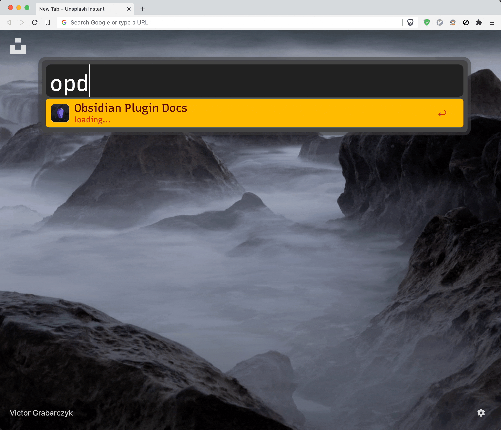

# Features for Developers

- [Plugin Developer Documentation Search](#plugin-developer-documentation-search)
- [Plugin Search](#plugin-search)
- [Open various folders related to development](#open-various-folders-related-to-development)
- [Vault-related features](#vault-related-features)
- [Beta Plugins](#beta-plugins)

## Plugin Developer Documentation Search
**`odd`: `O`bsidian `D`eveloper `D`ocumentation Search**
Searches the unofficial [plugin development documentation by Marcus Olsson](https://marcus.se.net/obsidian-plugin-docs/).

## Plugin Search
➡️ Refer to the [Plugin & Theme Search](Plugin%20and%20Theme%20Search.md#Plugins) for information about the theme search capabilities. Particularly useful for plugin developers should be:
- the [GitHub issue search](Plugin%20and%20Theme%20Search.md#searching-github-issues)
- `⌃ + ↵` to see and copy plugin IDs

## Open various folders related to development
- Refer to the section on [Quick Access to hidden folders](Utility%20Features.md#Open-Various-Folders) for further information.
- To quickly open local plugin folders in `.obsidian/plugins/`, use to the [Settings & Local Plugin Search](Settings%20and%20Local%20Plugin%20Search.md).

## Vault-related features
➡️ Refer to the documentation of the [Vault Switcher](Vault%20Switcher.md) for information about switching vaults quickly and open the vault root in Finder or the Terminal.

## Beta Plugins
**`obeta`: Access `beta`-plugin-related commands.**
- Add a new plugin to your beta plugins.
- Open the repository of a beta plugin.
	- Press `⌥ + ↵` to copy the GitHub repository URL to your clipboard. When Discord is the frontmost app, the copied link will be surrounded with `<` `>` for more convenient pasting in the Discord Desktop app (disables auto-preview).
- Update all beta plugins.
- All commands require the [BRAT Plugin](https://github.com/TfTHacker/obsidian42-brat).
- Install a new BETA theme.
